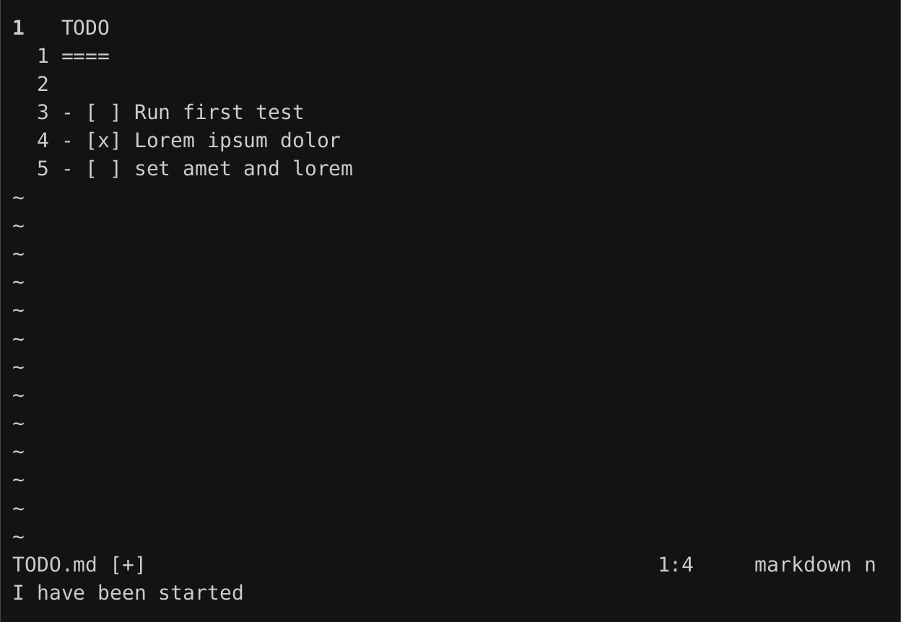

# NeoVim Markdown style Todo Toggler

## installation

packer:
```
  use { "unamatasanatarai/nvim-md-todo-toggle" }
```

## usage

default keybinding is `<leader>t`

command is: `:TDToggle`

[](https://asciinema.org/a/e7TQAXSL9tiL2jSZs2IXARmm8)


